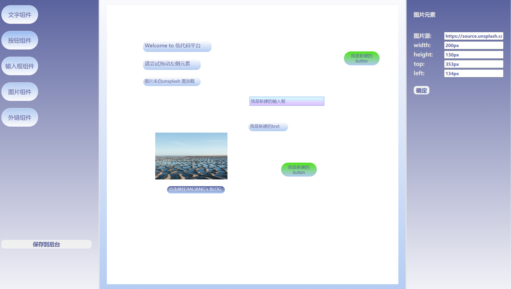

## LowCode低代码平台

该项目为基于React技术栈以及React-DnD拖拽库搭建的一款低代码编辑器，可作为一种能够极大提升开发效率的PaaS软件

### 项目展示

### 页面布局

该编辑器主要由「组件区」、「画布区」、「属性编辑区」这三个部分组成

> **组件区**负责展示可拖拽的组件(和组件间的层级关系)
>
> ​	实现功能：组件可拖拽--->拖拽后与画布区交互 & 组件数据上传后端
>
> **画布区**负责渲染拖拽的组件，进行可视化展示
>
> ​	实现功能：生成组件相应数据格式--->渲染组件--->选中组件与编辑区交互
>
> **属性编辑区**负责编辑所选中组件的相关属性
>
> ​	实现功能：处理属性变更--->反馈画布区 & 组件数据更改
